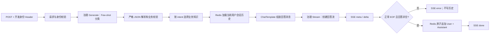

# Phase 2 综合生产化练习：技术设计

## 1. 目标与边界

新增 `examples/ai/phase2/13_customer_support_service/`，提供一个仅监听回环地址的电商智能客服 HTTP + SSE 服务。它是阶段 2 的最终综合题：基础设施和业务规则可直接运行，学习者只补全 AI 相关 TODO。未完成时服务在尝试任何模型网络调用前返回 `errExerciseIncomplete`，不会用伪答案或内存历史掩盖缺失实现。

本练习保持隔离：不接入现有电商 Controller、订单库、认证系统或阶段 3 之后的 RAG / Tool Calling 能力。

## 2. 目录与责任边界

```text
examples/ai/phase2/13_customer_support_service/
  README.md                         # 业务流程、TODO 学习路径、运行与验收说明
  main.go                           # 完整启动装配、仅回环监听、Redis Ping、优雅关闭
  config.go                         # 完整环境变量加载和安全配置校验
  http.go                           # 完整 Gin 路由、JSON 解码、SSE framing 和错误映射
  identity.go                       # 完整 X-Demo-User-ID 中间件与 Context 取值
  history.go                        # TODO：Redis Store 的隔离 Key、成对写入、截断、TTL
  knowledge.go                      # 完整业务知识加载和确定性 intent 选择
  provider.go                       # TODO：统一 Generate / Stream Provider 适配层
  classification.go                 # TODO：Few-shot、JSON Schema、严格解析和业务校验
  governance.go                     # TODO：调用超时、限流、重试、退避、指标
  service.go                        # TODO：两阶段 AI 编排、流式提交语义
  *_test.go                         # Fake Provider / Fake History Store 的离线测试
```

HTTP、身份、配置和知识选择不包含编号 TODO。学习者的 TODO 分散在 `provider.go`、`classification.go`、`history.go`、`governance.go`、`service.go`，避免把一个完整答案集中在入口函数中。目录契约测试会为本题增加跨文件连续 TODO 校验，并让 README 的 TODO 编号与所有核心文件一一对应。

## 3. 运行时配置与启动

`config.go` 提供以下环境变量和默认值：

| 配置 | 默认值 / 要求 | 用途 |
| --- | --- | --- |
| `AI_DEMO_LISTEN_ADDR` | `127.0.0.1:8093`，必须是 loopback | 服务监听地址 |
| `AI_DEMO_MODEL_BASE_URL` | `http://localhost:8084/v1` | OpenAI-compatible 服务地址 |
| `OPENAI_API_KEY` | 必填 | 模型认证，仅从环境读取 |
| `AI_DEMO_MODEL` | `gpt-5.4-mini` | 模型名 |
| `AI_DEMO_REDIS_ADDR` | `127.0.0.1:6379` | Redis 地址 |
| `AI_DEMO_HISTORY_TTL` | `30m` | 会话历史有效期 |
| `AI_DEMO_HISTORY_TURNS` | `6` | 保留的完整轮次数 |
| `AI_DEMO_CALL_TIMEOUT` | `30s` | 单次模型尝试超时 |
| `AI_DEMO_MAX_RETRIES` | `2` | 额外重试次数 |
| `AI_DEMO_INITIAL_BACKOFF` | `200ms` | 指数退避起点 |
| `AI_DEMO_CALLS_PER_SECOND` | `2` | 每个进程的模型调用速率 |

启动顺序：加载并校验配置 -> 创建 Redis Client -> 在有界 Context 内 `PING` Redis -> 构造内置业务知识 -> 创建 Provider Factory / 限流器 -> 注册 Gin 路由 -> 只绑定 `127.0.0.1`。Redis 失败直接退出；不得创建内存 Store 或隐式降级路径。日志只记录错误类别、调用阶段、attempt、延迟和 Token 数，绝不记录 Key、Authorization、完整 Prompt、完整用户消息或模型原始回复。

## 4. HTTP 与 SSE 契约

唯一业务接口为：

```text
POST /api/ai/chat/stream
Header: X-Demo-User-ID: <safe non-empty identifier>
Content-Type: application/json

{
  "session_id": "checkout-help",
  "message": "这款耳机多久能到？"
}
```

身份来自中间件写入的 `context.Context`，Service 的请求结构不包含 `user_id`。Header、`session_id` 和 `message` 在 SSE 开始前校验；失败时返回普通 JSON 错误。开始 SSE 后只发送下列事件，`data` 均为 JSON：

| 事件 | 数据 | 发送条件 |
| --- | --- | --- |
| `meta` | `intent`、`response_style`、`requires_handoff` | 分类严格校验成功后 |
| `delta` | `text` | 每个非空流式文本块 |
| `done` | 两阶段 attempts、各阶段/总延迟、各阶段/总 Token | EOF、完整回答校验和 Redis 提交均成功后 |
| `error` | 稳定 `code`、安全 `message` | SSE 已开始后的任一失败 |

服务不将底层 Provider / Redis 错误返回给客户端。`meta` 不包含 Few-shot 示例、Prompt、Key、业务知识全文或模型原始 JSON。

## 5. 数据流与提交不变量



关键不变量：

1. Redis Key 由受信任的 `userID + sessionID` 构成；只能读取当前用户当前会话的末尾 `maxTurns * 2` 条完整 User/Assistant 消息。
2. `AppendTurn` 在一次 `TxPipelined` 内 `RPUSH` 两条消息、`LTRIM` 到偶数消息上限、刷新 TTL。编码、角色校验或 Redis 任一失败都不产生半轮持久化。
3. 分类失败、回答流创建失败、流接收失败、客户端取消、空流、答案校验失败和历史提交失败都不能调用 `AppendTurn`。
4. 只有收到正常 EOF、已缓存完整 Assistant 文本且 Redis 提交成功，才发送 `done`。

## 6. 两阶段模型调用

### 6.1 分类阶段

分类 Provider 是统一 Provider Factory 创建的一个 Eino OpenAI-compatible ChatModel，配置严格 JSON Schema。结构化结果固定为：

```json
{
  "intent": "product_advice | delivery_return | after_sales | general",
  "response_style": "concise | guided | empathetic",
  "requires_handoff": false
}
```

Prompt 由 System 规则、三个固定 Few-shot User/Assistant 对及当前 User 消息组成。模型输出不做 Markdown 剥离、子串截取或自动修复；使用 `json.Decoder` + `DisallowUnknownFields`，拒绝第二个 JSON 值，再校验 enum、必填字段和布尔字段。任何解析或业务校验错误均不可重试，且不会进入回答阶段。

`knowledge.go` 内置 `product_advice`、`delivery_return`、`after_sales` 和 `general` 四段有限业务知识。选择器只以校验后的 `intent` 取值；不读取外部知识文件、不查询数据库、没有向量检索、没有 Tool Calling。

### 6.2 回答阶段

回答 Provider 与分类 Provider 实现同一 `chatProvider` 接口，但不携带 JSON Schema 输出格式。`ChatTemplate` 以 System（职责、边界和选中的业务知识）-> 可选 `history` -> User（本轮消息）顺序生成 Eino `schema.Message`。历史消息只来自 Redis Store；业务服务不维护跨请求内存切片。

Provider 边界统一为项目类型，避免 Service 依赖 Eino / OpenAI SDK：

```go
type chatProvider interface {
    Generate(context.Context, modelCall) (modelResult, error)
    Stream(context.Context, modelCall) (messageStream, error)
}

type messageStream interface {
    Recv() (modelChunk, error)
    Close()
}
```

`modelResult` / `modelChunk` 统一内容和可选 Token Usage。Eino adapter 负责 `schema.Message` 转换、`ResponseMeta.Usage` 读取及错误包装；Fake Provider 实现同一接口。流式 Usage 以最终出现的完整 Usage 为准，不把可能重复的累计 Usage 逐块相加。

## 7. 调用治理

分类 `Generate` 和回答 `Stream` 都必须通过同一治理层，并分别产出阶段指标。每一个实际远程尝试都执行以下顺序：

1. 检查父 Context，并在限流器上 `Wait`；等待取消时立即停止。
2. 创建本次尝试独立的 `context.WithTimeout(parent, callTimeout)`。
3. 调用 Provider；Generate 和失败的 Stream 创建在本轮立即 `cancel()`。
4. 仅满足白名单时以 `initial * 2^retryIndex` 退避，且上限 `maxBackoff`，等待期间响应父 Context 取消。

成功创建回答 Stream 后，该次 Context 必须由返回的 stream wrapper 持有，直到流 EOF、接收错误或调用方关闭；此时再先关闭底层 reader 并立即 `cancel()`。不能在 `Stream` 成功返回后立即取消，否则会把尚未消费的流提前中止。

`isRetryable` 仅允许：临时网络错误、429、500、502、503、504。参数、认证、403/404、解析/业务校验、父 Context 已取消、主动取消和单次尝试超时均不可重试。回答阶段仅在 `Stream(...)` 创建失败且尚未发送过任何 delta 时允许重试；一旦发出首个 delta，任何 `Recv()` 错误都只发送 SSE `error`，绝不重启流或拼接第二段回答。

每阶段记录 attempts、成功状态、延迟、prompt/completion/total Token；请求级 `done` 汇总二者。未提供 Usage 的 Provider 值为 0，并在内部指标中标识为 unavailable，不猜测 Token。

## 8. 引导式 TODO 设计

编号 TODO 跨核心文件连续编号，计划为 1–15：

| TODO | 主要文件 | 学习目标 | 对应前置练习 |
| --- | --- | --- | --- |
| 1–2 | `provider.go` | OpenAI-compatible 配置、Eino Generate/Stream adapter | 01、02、12 |
| 3 | `classification.go` | System / User / Assistant 角色 | 03 |
| 4 | `classification.go` | Few-shot 分类样本 | 04 |
| 5 | `service.go` | 多轮会话读取和成功后提交 | 05 |
| 6–7 | `history.go` | Redis 会话、隔离、截断、TTL、原子轮次 | 06、07 |
| 8 | `service.go` | ChatTemplate 与历史占位符 | 08 |
| 9 | `service.go` | SSE 流消费、EOF / 取消 / Close | 09 |
| 10–11 | `classification.go` | 原生 JSON Schema、严格解码和业务校验 | 10 |
| 12–14 | `governance.go` | 限流、独立超时、重试白名单和可取消退避 | 11 |
| 15 | `service.go` | 两阶段 Provider 边界与完整提交不变量 | 12 |

`history.go` 属于可观察、低层数据边界：其 TODO 只暴露会话一致性和 Redis 语义，不要求学习者重复写 Gin 或 JSON HTTP 样板。其余基础设施完整提供。未完成的 TODO 返回同一个 `errExerciseIncomplete`，并保证返回点位于 Provider 外部调用之前。

## 9. 离线验证设计

测试不连接 Redis 或模型：

- `fakeHistoryStore` 记录读写参数和已提交轮次，验证用户 / session 隔离、失败不提交、成功恰好提交一轮。
- `fakeProvider` 可按调用阶段给出 JSON 分类、流文本、流创建失败、接收失败、429、503、网络临时错误和不可重试错误。
- 成功路径校验调用顺序为分类 -> 上下文选择 -> 历史 -> 回答流 -> 原子保存，且 `done` 的两阶段指标可汇总。
- 失败路径覆盖 JSON 解析错误、不可重试错误、耗尽重试、父 Context 取消、首个 delta 后流错误、历史提交失败和没有首个 delta 的创建重试。
- HTTP 测试验证身份只来自 Header，Body 的伪造 `user_id` 无法影响 Store Key；SSE 事件顺序受契约约束。

骨架未完成时，端到端离线用例先断言 `errExerciseIncomplete` 且没有 Provider 请求；需要完整 AI 实现的断言以该错误为条件跳过。学习者完成全部 TODO 后，同一批 Fake 测试自动执行成功 / 失败行为验证，不需要真实外部服务。

真实烟测由 README 显式运行：先启动本地 Redis 和本地 OpenAI-compatible 服务，再以 `X-Demo-User-ID` 调用 SSE 接口。它只验证真实闭环，绝不替代离线测试；文档不出现 API Key、Authorization 或完整敏感 Prompt。

## 10. 兼容性、风险与回滚

- 依赖保持现有 Eino、Gin、go-redis 版本，不新增 RAG、认证、流式代理或监控依赖。
- 目录契约由第 13 题的跨文件 TODO 特例扩展；其余练习原有校验必须保持不变。
- 这是一组独立示例文件和文档；删除整个 `13_customer_support_service` 目录，并将目录计数 / 导航 / 路线图还原到 12，即可回滚，不影响生产业务包。
- 模型服务对 JSON Schema 或流式 Usage 的支持可能不同。服务对此明确失败或将 Usage 记为 unavailable，不静默降级到 prompt-only JSON 或虚构 Token。
